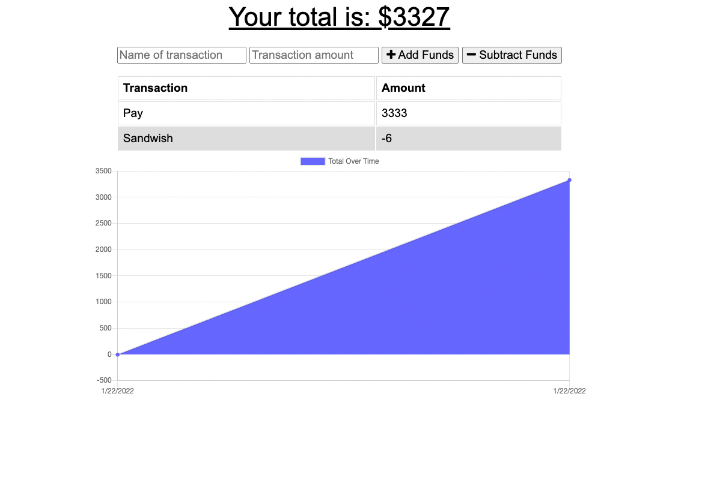

# Budget Tracker

## Description
This project showcases the modern tenets of a Progressive Web Application (PWA) allowing for the inputting of data without an internet connection utilizing IndexedDB and MongoDB when connected. In addition, service workers are employed to store the application files in the browser cache to load offline. Lastly, this application is fitted with a manifest.json file allowing users to download the application as PWAs should. Here is the link to the live web application on Heroku: https://desolate-coast-32517.herokuapp.com/

## Table of Contents
* [Installation](#installation)
* [Usage](#usage)
* [Questions](#questions)

## Installation
To install the repo, clone it to your machine and use `npm install` to add the packages required for use.

## Usage
To use with a local server after installed, use `npm start` in terminal to initiate the web server and navigate to `localhost:3001`.

## Questions
If you have any questions or to see other projects I've done, view my GitHub page here: https://github.com/chaldrich24.

## Screenshot

